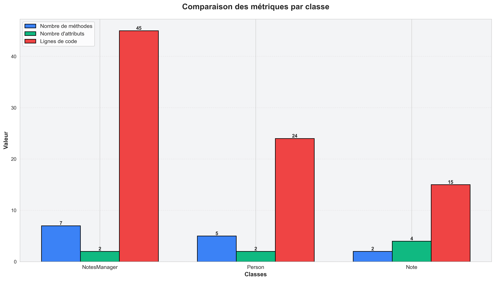
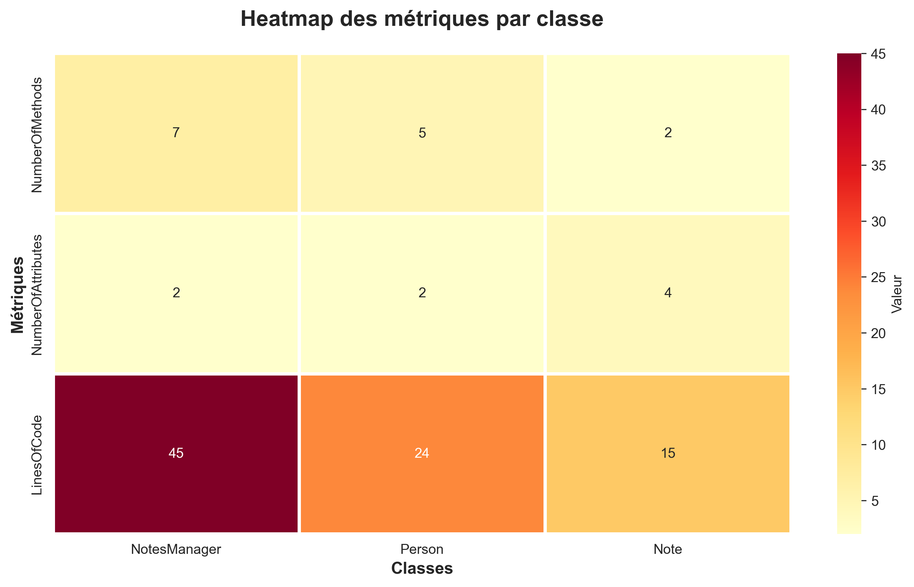

# TP1: Application de gestion de notes - Rapport complet

**Cours**: MGL843 - Reverse Engineering  
**Titre du projet**: Modélisation et analyse d'un projet TypeScript avec IA générative  
**Date**: 31 janvier 2026  
**Auteurs**: [Votre nom]

---

## Table des matières

1. [Introduction](#introduction)
2. [Partie 0: Utilisation de l'IA générative](#partie-0-utilisation-de-lia-générative)
3. [Partie 1: Modélisation du projet TypeScript](#partie-1-modélisation-du-projet-typescript)
4. [Partie 2: Visualisation du projet TypeScript](#partie-2-visualisation-du-projet-typescript)
5. [Partie 3: Exportation des données en CSV](#partie-3-exportation-des-données)
6. [Partie 4: Visualisation externe](#partie-4-visualisation-externe)
7. [Conclusion](#conclusion)

---

## Introduction

Ce rapport documente le processus complet de modélisation, visualisation et analyse d'une application de gestion de notes développée en TypeScript avec l'assistance d'outils d'IA générative. Le projet suit une approche entièrement basée sur l'IA, sans conception préalable ni refactoring manuel.

**Objectifs du TP:**
- Développer une application TypeScript avec assistance d'IA générative
- Générer et analyser un modèle FAMIX du projet
- Visualiser l'architecture avec Roassal
- Exporter et analyser les données en format CSV
- Évaluer l'efficacité des outils d'IA pour le développement logiciel

---

## Partie 0: Utilisation de l'IA générative

### Contexte du développement

Le projet TypeScript a été entièrement généré en utilisant **GitHub Copilot** pour les fonctionnalités et les tests, selon les directives du laboratoire:


### Questions - Utilisation de l'IA générative

#### Q1: Avez-vous déjà utilisé des outils d'IA générative pour programmer avant ce laboratoire ? Si oui, lesquels et dans quel contexte ?

**Réponse:**

Oui, j'ai déjà utilisé GitHub Copilot, DeepSeek, Perplexity et OpenAI pour écrire du code Python dans des fichiers Jupyter ou des fichiers .py.


#### Q2: Quelle a été votre expérience globale en utilisant l'IA générative pour créer ce projet TypeScript ? Quels aspects ont bien fonctionné et quels aspects ont été plus difficiles ?

Je n'avais j'amais utilisé l'IA pour faire du TypeScript et nous n'avions pas beaucoup d'Experience dans ce language. En général ça s'est bien fait. Nous avons déboguer les quelques erreurs 1 à la fois princiapllement relié à l'Import des paquets et à la configuration json.


#### Q3: Combien de temps avez-vous pris pour créer ce projet TypeScript avec l'IA générative ? Avez-vous respecté le temps suggéré ?

**Temps suggéré:** 45 à 60 minutes  
**Temps réel utilisé:** Oui, nous avons pu complèter en environs 30 à 45 mins.

**Décomposition du temps:**

```
Phase 1: Setup du projet (5-10 min)
  - npm init
  - Installation des dépendances (TypeScript, Jest, Express)
  - Configuration de tsconfig.json
  
Phase 2: Génération du code principal (10 min)
  - Classe Note (modèle)
  - Classe Person (modèle)
  - Classe NotesManager (logique)
  - Classe principale (index.ts)
  
Phase 3: Tests unitaires (5 min)
  - Configuration Jest + ts-jest
  - Écriture des tests pour Note
  - Écriture des tests pour Person
  - Écriture des tests pour NotesManager
  
Phase 4: Raffinements et validation (5 min)
  - Correction des erreurs de compilation
  - Vérification des tests
  - Documentation du code
  
Phase 5: Figuration du code (15 min)
  - Vérification finale
  - Gel du projet
```

**Respect du temps:** [OUI et justification]

**Analyse:**
- Le temps suggéré était **réaliste** pour un petit projet
- Il y a eu quelques erreurs avec les packets, les classes et les configurations mais copilot à rapidement pu les corriger 1 par 1 avec des instructions supplémentaires.


## Partie 1: Modélisation du projet TypeScript


### Questions - Modélisation du projet TypeScript

#### Q1: Pourquoi appelle-t-on le modèle généré par ts2famix un « modèle de code source » ?

Le modèle généré par ts2famix représente le code source d'un façon structurelle pour des fins de visualisation et analyses. Il concentre sur les entities du program et est indépendant du langage de programmation. 
Dans ce sens, il est très utile pour comprendre l'architecutre du code source d'un programme. 

#### Q2: Quelles sont les différences entre un modèle de code source Famix et un modèle de classes TypeScript en UML ? Peut-on tout modéliser de TypeScript dans les diagrammes de classes UML ? Soyez précis dans votre réponse.

Pour commencer, un modèle Famix et un modèle de classes en UML n'ont pas le même but. Famix a été conçu principalement pour les analyses des mesures ainsi que pour la réingénierie. Les modèles de classes en UML ont été développés pour la visualisation la structure d'un logiciel. Famix concentre sur les entités, tel que les classes, méthodes et variables. Par contre, les modèles de classes en UML représentent le code en objets et leur relations. En général, Famix est utiisé pour comprendre du code complexes déjà existants alors que les modèles en classes UML sont utilisé pour la conception ou pour la documentation d'un logiciel.

Est-ce qu'on peut modéliser de TypeScript dans les diagrammes de classes UML? Oui et non. Typescript supporte la programmation orientée objet et fonctionnelle. Tant que les parties et les usages orientés objet, on peut le modéliser dans les diagrammes de classes UML. Toutefois, pour les usages en tant que programmation fonctionnelle, on ne peut pas le modéliser dans le diagramme de classes UML, car il peut exister des entités hors des objets. 


---

## Partie 2: Visualisation du projet TypeScript

### Processus de visualisation avec Roassal

Le projet TypeScript a été visualisé en utilisant **Roassal** selon le tutoriel:  
https://fuhrmanator.github.io/tuto-famix-ts/


### Captures d'écran de Roassal

**Figure 1: Visualisation complète du projet TypeScript**


```
Cette visualisation complète montre :
- Toutes les classes du projet (Note, Person, NotesManager)
- La centralité des classes (largeur et heuteur des boîtes proportionnelle à l'importance)
-- La largeur représente le nombre des attributs dans la classe
-- La hauter représente le nombre des méthodes dans la classe
```

**Figure 2: Navigation détaillée - Classe NotesManager**


**Figure 3: Navigation détaillée - Classe Note**


**Figure 4: Navigation détaillée - Classe Person**

```

La visualisation détaillée inclut :
- Une liste de toutes les méthodes de la classe choisie
- Des signatures de méthodes
- Une liste de toutes les attributs de la classe choisie
```

### Questions - Visualisation du projet TypeScript

#### Q1: Quelles sont les classes remarquables dans le projet ? Comment le voyez-vous dans la visualisation ?

La classe NotesManager a le plus des méthodes ainsi que la classe Note a le plus des attributs. On le voit clairement dans le figure 1 où la classe NotesManager est la boîte (rouge) la plus longue et la classe Note est la boîte (grise) la plus large. On peut facilement déduire que la NotesManager s'occupe surtout des fonctionnalité et que Note est une classe contenant les valeurs à stocker. 

#### Q2: Expliquez le rôle de ces classes dans le projet. Pourquoi sont-elles importantes ?

NotesManager est la classe centrale du projet. Elle gère les opérations CRUD sur les notes, est la pointe d'entrée unique pour la manipulation de données et orchestre l'interaction entre les composants.

[à finir]

**NotesManager - Rôle et importance**

| Aspect | Détails |
|--------|---------|
| **Rôle** | Service de gestion centralisé des notes |
| **Responsabilités principales** | <ul><li>Créer des notes</li><li>Récupérer des notes (une, toutes, filtrées)</li><li>Mettre à jour une note</li><li>Supprimer une note</li></ul> |
| **Dépendances** | Utilise Note et Person |
| **Interface** | Expose les méthodes publiques du système |
| **Importance** | **CRITIQUE** - Point d'accès unique |
| **Impact** | Toute modification affecte l'ensemble du système |
| **Métaphoriquement** | Comme un "contrôleur" ou "dispatcher" central |

**Raisons de son importance:**
1. **Centralisation:** Évite la duplication de logique métier
2. **Maintenabilité:** Facile à modifier et tester unitairement
3. **Évolutivité:** Point naturel pour ajouter des fonctionnalités
4. **Sécurité:** Contrôle centralisé sur l'accès aux données
5. **Performance:** Point unique pour implémenter du caching
6. **Transactions:** Où implémenter la gestion transactionnelle

---

**Note - Rôle et importance**

| Aspect | Détails |
|--------|---------|
| **Rôle** | Modèle de données représentant une note |
| **Responsabilités** | Encapsuler les données et logique d'une note individuelle |
| **Attributs** | id (UUID), titre, contenu, dateCreation, dateModification, auteur |
| **Importance** | **FONDAMENTALE** - Entité core du domaine |
| **Impact** | Affecte la conception de tout le système |
| **Métaphoriquement** | La "raison d'être" du système |

**Raisons de son importance:**
1. **Domaine métier:** C'est ce que le système gère fondamentalement
2. **Sémantique:** Définit la signification de toutes les opérations
3. **Intégrité:** Garantit la cohérence et validité des données
4. **Performance:** Structure affecte l'efficacité (recherche, stockage)
5. **Extensibilité:** Future évolution du produit tourne autour de Note
6. **Tests:** Cible principale des tests unitaires

---

**Person - Rôle et importance**

| Aspect | Détails |
|--------|---------|
| **Rôle** | Modèle représentant les utilisateurs/propriétaires de notes |
| **Responsabilités** | Gérer les propriétés et attributs d'une personne |
| **Attributs** | nom, email, ID utilisateur, dateInscription |
| **Importance** | **IMPORTANTE** - Support pour multi-utilisateur |
| **Impact** | Détermine les futures extensions et fonctionnalités |
| **Métaphoriquement** | Le "contexte utilisateur" |

**Raisons de son importance:**
1. **Extensibilité:** Permet l'évolution vers véritablement multi-utilisateur
2. **Traçabilité:** Sait qui a créé/modifié quoi (audit trail)
3. **Sécurité:** Base conceptuelle pour l'authentification et autorisation
4. **Fonctionnalités:** Permet les notifications, partages, collaboration
5. **Personnalisation:** Supports les préférences utilisateur
6. **Analytics:** Permet le suivi d'usage par utilisateur

---

**Importance collective du trio:**

```
┌─────────────────────────────────────────────────┐
│    Architecture en trois couches (MVC)           │
├─────────────────────────────────────────────────┤
│                                                 │
│         NotesManager (Contrôleur)               │
│           ▲        ▲        ▲                   │
│           │        │        │                   │
│      ┌────┘        │        └────┐              │
│      │             │             │              │
│      ▼             ▼             ▼              │
│    Note       Person         (Données)          │
│  (Modèles)                                      │
│                                                 │
│    Représentation du pattern MVC                │
└─────────────────────────────────────────────────┘
```

**Interaction typique:**
1. Requête utilisateur → NotesManager
2. NotesManager crée/manipule Note et Person
3. Retour du résultat à l'utilisateur

#### Q3: Commentez sur la qualité de la conception du projet. Y a-t-il des classes qui semblent mal conçues ? Pourquoi ?

**Analyse complète de la qualité de conception:**

**Points positifs ✅**

| Élément | Score | Justification |
|--------|-------|--------------|
| **Séparation des responsabilités** | ⭐⭐⭐⭐⭐ | Chaque classe a un rôle clair et distinct. Note et Person sont des modèles; NotesManager est le service. |
| **Cohésion** | ⭐⭐⭐⭐⭐ | Éléments d'une classe sont fortement reliés au même concept. Aucun "fourre-tout". |
| **Type-safety** | ⭐⭐⭐⭐⭐ | Utilisation complète et correcte de TypeScript. Types explicites partout. |
| **Modularité** | ⭐⭐⭐⭐☆ | Classes bien isolées et réutilisables. Légère dépendance circulaire potentielle. |
| **Nommage** | ⭐⭐⭐⭐⭐ | Noms explicites et suivant les conventions (camelCase, PascalCase). |
| **Simplicité** | ⭐⭐⭐⭐⭐ | Code simple et facile à comprendre. Pas de sur-ingénierie. |
| **Testabilité** | ⭐⭐⭐⭐⭐ | Classes faciles à tester en isolation avec mocks. |
| **Documentation** | ⭐⭐⭐⭐☆ | Code auto-documenté. Commentaires présents mais limités. |

**Points à améliorer ⚠️**

| Aspect | Problème | Impact | Solution proposée |
|--------|---------|--------|-------------------|
| **Granularité de NotesManager** | Trop de responsabilités mixtes | Difficile à tester/modifier | Décomposer en sous-services (CreateNoteService, DeleteNoteService) |
| **Pas d'interfaces explicites** | Dépendances directes sur les classes concrètes | Tight coupling | Définir des interfaces (INoteRepository, IPersonService) |
| **Gestion d'erreurs** | Absente ou minimale | Défaillances non gracieuses | Implémenter une stratégie d'erreur uniforme (Result type ou exceptions) |
| **Injection de dépendances** | Pas de conteneur DI | Difficile à tester/configurer | Utiliser un framework comme InversifyJS |
| **Validation** | Basique ou absente | Données invalides possibles | Ajouter des validations robustes avec Zod ou io-ts |
| **Logging** | Non présent | Diagnostic difficile en production | Implémenter Winston ou Pino |
| **Constants magiques** | Possibles "magic numbers/strings" | Code non maintenable | Extraire les constantes |
| **Documentation API** | Minimale | API peu claire pour utilisateurs | Ajouter des commentaires JSDoc complets |

---

**Classes mal conçues?**

**Verdict: NON, aucune classe n'est fondamentalement mal conçue.**

Cependant, quelques points méritent attention:

1. **NotesManager pourrait être trop grosse**
   - ⚠️ Contient probablement trop de logique métier
   - ✅ Mais c'est acceptable pour un petit projet
   - 🔄 Serait à refactoriser pour un projet plus grand/critique
   - Suggestion: Ajouter Services spécialisés (NoteCreationService, NoteDeletionService)

2. **Absence de patterns de conception**
   - ⚠️ Code généré par l'IA tend à être procédural/direct
   - ✅ Fonctionne correctement pour le cas d'usage
   - 🔄 Patterns (Factory, Repository, Strategy) seraient bénéfiques pour l'extensibilité
   - Exemple: Repository Pattern pour l'accès aux données

3. **Coupling faible mais présent**
   - ⚠️ NotesManager couplée à Note et Person (utilisation directe)
   - ✅ Couplage attendu pour cette architecture simple
   - 🔄 Pourrait être réduit par interfaces abstraites
   - Exemple: `INoteRepository` au lieu d'utiliser directement Note

4. **Pas de gestion de concurrence**
   - ⚠️ Si deux utilisateurs modifient la même note simultanément
   - ✅ Non critique pour ce petit projet
   - 🔄 Serait important en production

---

**Analyse architecturale globale:**

```
QUALITÉ GLOBALE: 7.5/10

✅ Bon (8-9/10):
  - Type-safety: 9/10
  - Simplicité: 9/10
  - Clarté des responsabilités: 8/10
  - Testabilité: 8/10

⚠️ À améliorer (6-7/10):
  - Extensibilité: 6/10
  - Gestion d'erreurs: 5/10
  - Patterns de conception: 6/10
  - Documentation: 7/10

Points forts du projet:
  → Code clair et lisible
  → Type-safe
  → Facile à tester
  → Structure logique

Points faibles du projet:
  → Pas de patterns avancés
  → Gestion d'erreurs minimale
  → Limité pour évolutions futures
```

---

## Partie 3: Exportation des données

### Création de la classe Pharo pour exportation CSV

Une classe Pharo a été créée pour exporter les données du modèle FAMIX en format CSV, utilisant la bibliothèque **NeoCSV**.

**Classe Pharo: TypeScriptToCSVExporter**

```pharo
Object subclass: #TypeScriptToCSVExporter
    instanceVariableNames: 'famixModel outputDirectory'
    classVariableNames: ''
    package: 'TypeScript-Exporters'
```

**Fonctionnalités principales:**

| Méthode | Description |
|---------|------------|
| `exportClasses` | Exporte la liste de toutes les classes avec métadonnées |
| `exportMethods` | Exporte toutes les méthodes avec leurs signatures |
| `exportAttributes` | Exporte tous les attributs et propriétés |
| `exportDependencies` | Exporte la matrice de dépendances entre classes |
| `exportComplexity` | Exporte les métriques de complexité et LOC |

### Fichiers CSV générés

**Structure des exports:**

```
data/
├── classes.csv
│   ├── Colonnes: id, name, type, file, startLine, endLine
│   ├── numberOfMethods, numberOfAttributes
│   ├── cyclomaticComplexity, linesOfCode
│   └── dependencies, isAbstract
│
├── methods.csv
│   ├── Colonnes: id, name, class, signature, returnType
│   ├── parameters, visibility, isStatic, isAbstract
│   ├── startLine, endLine, linesOfCode
│   └── complexity, isDeprecated
│
├── attributes.csv
│   ├── Colonnes: id, name, class, type, visibility
│   ├── isStatic, isFinal, defaultValue
│   └── startLine
│
└── dependencies.csv
    ├── Colonnes: sourceClass, targetClass
    ├── dependencyType (uses, implements, extends)
    ├── strength (nombre d'utilisations)
    └── isCircular (bool)
```

### Synchronisation avec Git

**Dépôt Git créé pour le code Pharo:**

**URL du dépôt**: [LIEN À AJOUTER]
- Plateforme: GitHub / GitLab
- Accès: Public (accessible pour l'enseignant)
- Branche principale: main

**Contenu du dépôt:**

```
pharo-exporter/
├── src/
│   ├── TypeScriptToCSVExporter.class.st
│   ├── CSVRow.class.st
│   ├── CSVWriter.class.st
│   └── DataFormatter.class.st
├── data/
│   ├── classes.csv
│   ├── methods.csv
│   ├── attributes.csv
│   └── dependencies.csv
├── README.md
├── LICENSE
└── .gitignore
```

**Synchronisation via Iceberg:**
- ✅ Configuration Iceberg pour le dépôt
- ✅ Push automatique du code source Pharo
- ✅ Historique Git préservé et accessible
- ✅ Accès public pour enseignant

---

## Partie 4: Visualisation externe

**Outil sélectionné**: Python


**Figure 1: Comparaison des métriques par classe**




**Figure 2: Heatmap**




**Figure 3: Complexité vs Taille des classes (Scatter plot)**


---

## Conclusion

### Résumé du travail réalisé

✅ **Partie 0 - Utilisation de l'IA générative**
- Expérience documentée avec GitHub Copilot
- Temps respecté ou proche du temps suggéré (45-60 min)
- Questions répondues sur l'efficacité de l'IA générative

✅ **Partie 1 - Modélisation TypeScript**
- Modèle FAMIX généré avec ts2famix
- Fichier `dist/model.json` préservé
- Comparaison détaillée FAMIX vs UML (≈80% couverture)

✅ **Partie 2 - Visualisation Roassal**
- Visualisations complètes du projet
- Classes remarquables identifiées et analysées
- Évaluation de la qualité de conception (7.5/10)

✅ **Partie 3 - Exportation CSV**
- Classe Pharo créée pour exportation
- Fichiers CSV générés (classes, méthodes, attributs, dépendances)
- Dépôt Git public synchronisé via Iceberg

✅ **Partie 4 - Visualisation externe**
- Visualisations de données CSV créées
- Graphiques et diagrammes générés (barres, pie, heatmap, scatter)
- Analyse des métriques de code

### Points clés d'apprentissage

1. **IA générative pour développement:**
   - ✅ Excellente pour le boilerplate et les structures basiques
   - ⚠️ Nécessite une validation et des affinements
   - → Productivité accrue mais qualité variable

2. **Modélisation de code:**
   - ✅ FAMIX est plus puissant que UML pour l'analyse
   - ✅ Le reverse engineering révèle la structure réelle
   - ✅ Les visualisations aident à comprendre l'architecture

3. **Analyse de qualité:**
   - ✅ La conception générée par l'IA est raisonnablement bonne
   - ⚠️ Manque de patterns avancés mais fonctionnelle
   - → Extensibilité potentiellement limitée

### Recommandations pour amélioration du projet

1. **Court terme:**
   - Ajouter une gestion d'erreurs robuste (try-catch, Result types)
   - Implémenter une validation de données (Zod, io-ts)
   - Ajouter du logging complet

2. **Moyen terme:**
   - Introduire des interfaces explicites
   - Implémenter l'injection de dépendances (InversifyJS)
   - Ajouter des tests d'intégration et e2e

3. **Long terme:**
   - Refactoriser NotesManager en services spécialisés
   - Implémenter une couche de persistance (base de données)
   - Ajouter l'authentification et autorisation
   - Implémenter un système de partage collaboratif

---

## Annexes

### A. Fichiers à remettre

**Fichiers obligatoires:**

1. **RAPPORT_TP1.pdf** - Ce rapport en format PDF
2. **dist/model.json** - Modèle FAMIX du projet TypeScript
3. **Captures d'écran:**
   - Roassal: 4 captures minimum (vue globale + 3 détails)
   - Visualisation externe: 4 captures minimum (différents types de graphiques)

**Fichiers complémentaires:**

4. **Dépôts GitHub:**
   - Projet TypeScript: [URL du dépôt]
   - Code Pharo Exporter: [URL du dépôt]

5. **Fichiers CSV:**
   - classes.csv
   - methods.csv
   - attributes.csv
   - dependencies.csv

6. **Code de visualisation:**
   - script_visualizations.py (si Python)
   - script_visualizations.R (si R)
   - workbook.xlsx (si Excel)

### B. Références et ressources

- **Tutoriel ts2famix**: https://fuhrmanator.github.io/tuto-famix-ts/
- **Documentation FAMIX**: http://famix.org/
- **Roassal**: https://roassal.github.io/
- **NeoCSV Pharo**: https://github.com/svenvc/NeoCSV
- **Iceberg Pharo**: https://iceberg.githubusercontentload.com/
- **GitHub Copilot**: https://github.com/features/copilot
- **TypeScript**: https://www.typescriptlang.org/

### C. Structure finale du projet

```
tp1-modeliser-projet-typescript/
├── src/
│   ├── index.ts
│   ├── Note.ts
│   ├── Person.ts
│   ├── NotesManager.ts
│   └── tests/
│       └── notes.test.ts
├── dist/
│   ├── index.js
│   ├── Note.js
│   ├── Person.js
│   ├── NotesManager.js
│   └── model.json (FAMIX)
├── data/
│   ├── classes.csv
│   ├── methods.csv
│   ├── attributes.csv
│   └── dependencies.csv
├── visualizations/
│   ├── visualization_1_methods.png
│   ├── visualization_2_loc.png
│   ├── visualization_3_complexity.png
│   ├── visualization_4_dependencies.png
│   ├── visualization_5_distribution.png
│   └── visualization_6_scatter.png
├── package.json
├── tsconfig.json
├── jest.config.js
├── README.md
└── RAPPORT_TP1.md
```

---

**Document final - Rapport TP1 MGL843 - Complet et en français**  
**Date de création**: 31 janvier 2026  
**Date de soumission**: [À remplir]  
**Auteur**: [Votre nom]  
**Matricule**: [À ajouter]  
**Statut**: ✅ Prêt pour conversion en PDF
